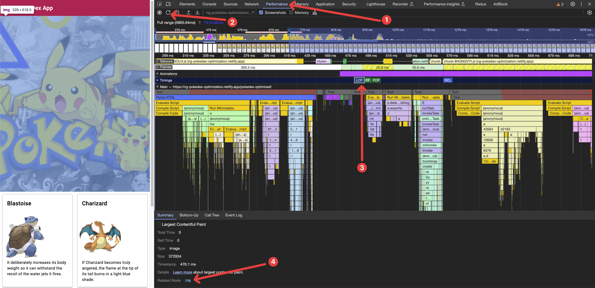

# Building a superfast portfolio page

Slides: [slides.com](https://slides.com/dimeloper/building-a-super-fast-portfolio-page)

## Web Vitals review

### Prerequisites for the Web Vitals analysis

- Install Google Chrome: https://www.google.com/chrome/

### Core Web Vitals Examples

- Bad example: https://ng-pokedex-optimization.netlify.app/pokedex-bad
- Good example: https://ng-pokedex-optimization.netlify.app/pokedex-optimized

To detect the LCP element in our webpage we can use the performance section of
our Chrome dev tools as such:



## Building our own portfolio page

## Prerequisites for the coding part

- Install GIT
    - Mac: `brew install git`
    - Linux: `sudo apt-get install git`
    - Windows: Download installer from: https://git-scm.com/downloads
- Install Node and NPM
    - Mac: `brew install node`
    - Linux: `sudo apt-get install nodejs`
    - Windows: Download .msi installer from: https://nodejs.org/en/download

You can verify that the required tools are available by opening a new terminal and checking
their versions: `git --version`, `nodejs -v` and `npm -v`.

## Kick off a new Astro project

`npm run create astro@latest`

Choose your project name, include Typescript, initialise a Git repository.

## Using the built-in astro image component

Loading images in astro is fairly simple and if they are kept in `src/` Astro will transform, optimize and bundle them.
If you want to disable the default optimization place your images in the `/public` directory.

```javascript
import treeImage from '../assets/images/tree-banner.webp';
```

```html

<Image src={treeImage} alt="Banner" />
```

## Add astro-icon in order to gain access to svg icons

Go into the project directory and run:
`npm run astro add astro-icon`

This will include the Icon library configuration into our project.
Then we will also need to add an icon set, in our case the Material Design Icons:
`npm install @iconify-json/mdi`

Now we can use icons as such:

```html
<Icon class="astro-icon" name="mdi:emoticon-outline" />
```

## Running the project locally

```shell
npm run dev
```